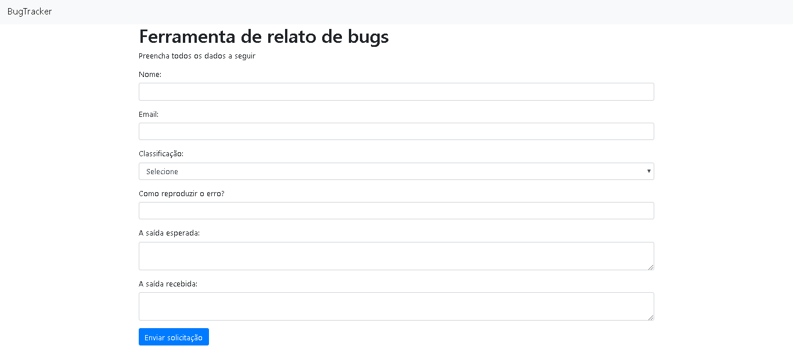

# BugTracker
:bug: Sistema simples de chamados, onde qualquer usuário pode reportar bugs ou melhorias.

### [Demonstração](https://bugtracker.zzeris.now.sh/)



## Executando local

### Pré-requisitos

* Você deve ter o node instalado em sua máquina;
* Você deve ter o git instalado em sua máquina;
* Você deve ter npm ou yarn instalado em sua máquina;
* Você precisa ter SENDGRID_API_KEY e GOOGLECLOUD_API_KEY.

Para executar este projeto, siga as instruções abaixo:

1. Abra o Prompt de comando (CMD);

2. Clone este repositório do github:

```
$ git clone https://github.com/Zzeris/bugtracker.git
```

3. Vá para a pasta bugtracker:

```
$ cd bugtracker
```

4. Agora, execute:

```
$ yarn
```

5. Adicione um arquivo .env na raiz da aplicação contendo SENDGRID_API_KEY e GOOGLECLOUD_API_KEY;

6. Execute o aplicativo em modo de desenvolvimento:

```
$ yarn dev
```

Acesse http://localhost:3333 para visualizá-lo no navegador.
